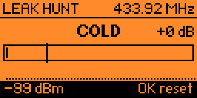

<!-- banner: paper by default, true black when the reader's GitHub is dark -->
<p align="center">
  <picture>
    <source media="(prefers-color-scheme: dark)" srcset="images/banner-dark.png">
    
  </picture>
</p>

<p align="center">
  <sub>
    The scale on the banner is not a graphic. It is Faraday's own grading
    thresholds, read out of <code>helpers/fdy_grade.h</code> by the renderer at
    build time — the same <code>#define</code>s the firmware branches on — so
    the artwork cannot drift from the app. The hatched zone is the region it
    refuses to grade at all, and the screen beside it is a real capture.
  </sub>
</p>

<p align="center"><i>Prove your pouch works.</i></p>

<p align="center">
  <a href="https://at0m-b0mb.github.io/Faraday-FlipperZero/"><b>Project site</b></a>
  &nbsp;·&nbsp;
  <a href="https://github.com/at0m-b0mb/Faraday-FlipperZero/releases/latest">Download</a>
  &nbsp;·&nbsp;
  <a href="CHANGELOG.md">Changelog</a>
</p>

<!-- live badges: these track the repo, so the README never goes stale -->
<p align="center">
  <a href="https://github.com/at0m-b0mb/Faraday-FlipperZero/releases/latest"></a>
  <a href="https://github.com/at0m-b0mb/Faraday-FlipperZero/releases"></a>
  <a href="https://github.com/at0m-b0mb/Faraday-FlipperZero/stargazers"></a>
  <a href="https://github.com/at0m-b0mb/Faraday-FlipperZero/actions/workflows/build.yml"></a>
</p>

<p align="center">
  
  
  
  
  
</p>

<p align="center">
  A signal-blocking pouch is a <b>claim</b>. <b>Faraday</b> is the <b>measurement</b>.
  You bought the pouch so your car key cannot be <b>relayed out of your hallway</b>, or so your
  contactless cards cannot be <b>read through your bag</b> — and almost nobody checks that it
  works, because the ones that do not work look exactly like the ones that do. Faraday measures
  your fob <b>in the open air</b>, measures it again <b>sealed in the pouch</b>, and tells you
  <b>how many decibels the pouch actually took off</b> — then grades it <b>A+ to F</b>. It uses
  only the hardware already inside a Flipper Zero, and it <b>never transmits</b>.
</p>

<p align="center"><sub>A pouch is a claim. This is the number.</sub></p>

<p align="center">
  <sub>
    <b>And it tells you when it cannot help.</b> A shielded reading can never sink below the
    noise floor, so a weak baseline caps your grade however good the pouch is — Faraday shows
    you that ceiling <i>before</i> you commit, and marks a result that hit it.
    <a href="#the-honesty-rules">Why, and what to do about it.</a>
  </sub>
</p>

---

## On the Flipper

<p align="center">
  
</p>

<p align="center">
  <sub>
    Every picture in this repository was captured from a real Flipper over USB by
    <a href="tools_screenshot.py"><code>tools_screenshot.py</code></a>. There is no mockup
    renderer: a drawing of the UI is a second implementation of it that can disagree with the
    firmware while looking perfectly convincing. Version 1.3 deleted the one this repo shipped.
  </sub>
</p>

### Every screen

<p align="center">
  <picture>
    <source media="(prefers-color-scheme: dark)" srcset="images/screens-dark.png">
    
  </picture>
</p>

<p align="center">
  
  &nbsp;&nbsp;
  
</p>

---

## How a test works

Two captures and a grade. That is the whole idea.

1. **Baseline** — hold your fob next to the Flipper in the open air and press it. When a
   carrier rises clear of the noise, press OK to lock the reading.
2. **Shielded** — seal the same fob in the pouch, hold it in the same place, press it again.
   Press OK.
3. **Verdict** — the difference between the two readings is the attenuation, in dB, with a
   letter grade and a one-line verdict.

Keep the distance and the angle the same between the two captures. The number is a
comparison of two readings from one setup; move the fob and you are measuring the move.

### Sub-GHz — the real measurement

The internal CC1101 reports RSSI in **actual dBm**, so the difference between two readings
is a genuine decibel figure. `-42 dBm` in the open against `-96 dBm` in the pouch is 54 dB
of shielding, and that is a number you can compare between pouches and quote to someone.

Bands: 315, 433.92, 868.35 and 915 MHz — car keys, garage and gate remotes, alarm fobs.
A fob transmits on **one** band, so pick the right one in Settings.

### NFC — the field a skimmer would use

A contactless card is passive: it has no battery and needs the reader's own 13.56 MHz field
to power up at all. So the useful question is how much of that field the pouch keeps out.
Faraday measures the field-detect duty cycle with and without the pouch and scores the
percentage blocked.

That is deliberately **not** called dB. A duty cycle is carrier presence, not carrier power,
and quoting it in decibels would be inventing precision the measurement does not have.

### Find my band

A fob transmits on **one** band, and which one depends on where the car was sold: 315 MHz
across much of North America, 433.92 across Europe, 868 and 915 elsewhere. Rather than making
you know that, hold the fob against the Flipper and let it sweep all four — it saves the
winner to Settings.

It refuses to guess. A band has to lead the runner-up by 25 dB to be called, because naming
the wrong one is not recoverable: every measurement afterwards would be taken against noise.
With nothing transmitting it says "No fob heard".

### Leak Hunt

A grade tells you a pouch leaks. Leak Hunt tells you **where**. Seal the fob, hold its
button down, and sweep the Flipper along the seams, the zip, the fold and the corners. The
meter, the warmer/colder word and the geiger clicks all peak over the spot the RF is
escaping from — everything measured against the tracked noise floor, so it reads the same
whether you are hunting a strong fob or a weak one.

---

## The honesty rules

These are the point of the app, not a disclaimer at the bottom of it.

**It refuses to grade noise.** A carrier has to rise at least 20 dB above the tracked noise
floor before Faraday will accept a baseline, and it says so on screen when it refuses. That
threshold is measured, not guessed: on a quiet 433.92 MHz channel with nothing transmitting,
peak-hold reaches +13 dB above the floor within five seconds and +14 dB by ninety. At the
8 dB this app used to require, a baseline made of pure noise sailed through — and the whole
refusal was decorative.

**It says "at least" when it means at least.** If the shielded reading sinks into the noise
floor, the real attenuation is *somewhere past* what was measured. Faraday prints `>= 47 dB`
rather than pretending the floor is the signal.

**It says NO DROP when nothing dropped.** A shielded reading that is not weaker than the
open-air one is not zero attenuation, it is a measurement that did not work. Faraday says
so instead of printing a confident `0 dB`.

**It never transmits.** Both radios are receive-only for the whole of this app's life.

**It is relative, not a lab.** This is a comparison of two readings taken the same way, not
a calibrated anechoic-chamber figure. It is the right tool for "is this pouch doing
anything, and is it better than that one" and the wrong tool for a specification.

---

## Install

Grab `faraday.fap` from the [latest release](https://github.com/at0m-b0mb/Faraday-FlipperZero/releases/latest)
and drop it in `SD Card/apps/Tools/` with qFlipper. It appears under **Apps → Tools →
Faraday**.

Two builds are attached to every release, because a `.fap` bakes in its API version:

| File | For |
| --- | --- |
| `faraday.fap` | Official firmware (release channel) |
| `faraday-fw-dev.fap` | Unleashed, RogueMaster, Momentum (dev channel) |

If the launcher warns `APP:87 < FW:88`, you have the other one.

### Building it yourself

```bash
python3 -m pip install --upgrade ufbt
ufbt update --channel=release   # or dev
ufbt                            # build
ufbt launch                     # build, install and run over USB
```

The grading engine is pure C with no Flipper headers, so it unit-tests on the host:

```bash
make -C test
```

---

## Using it

**A key fob.** Run **Find my fob's band** once — hold the fob against the Flipper and it
saves the right band for you. Then **Test Sub-GHz**: hold the fob beside the Flipper and
press its button until the strip says a signal was found, then OK. Seal the **fob** in the
pouch, put it in the same spot, press its button again, then OK.

Watch `max A+` in the corner while you take the baseline. That is the best grade this setup
can physically prove, because a shielded reading can never sink below the noise floor — if
it reads `max A`, move the fob closer before you lock, or you will cap a perfect pouch at A.

**Contactless cards.** You need a live reader field to measure against — a phone with NFC
on doing a payment prompt works fine. **Test NFC**, hold the Flipper in the field, lock the
baseline, then seal the **Flipper** (it is standing in for your card) and wait out the
countdown. It freezes the result, so you can take it back out before pressing OK.

**Finding a leak.** Leak Hunt, then sweep slowly. The clicks speed up as you approach.

**Comparing pouches.** Every finished test is appended to `results.csv` on the SD card, so
you can measure three pouches in a shop and compare them properly later instead of trusting
your memory of three numbers. Saved results shows the newest twenty on the device.

---

## Limits worth knowing

- **Sub-GHz needs your fob to actually transmit.** No press, no reading. Faraday cannot make
  your key talk.
- **NFC needs an external reader field.** The Flipper is listening for someone else's
  carrier, not making one.
- **13.56 MHz only.** There is no 125 kHz equivalent: the LF path has no field-detect bit to
  read, so there is nothing to measure. See [Bastion](https://github.com/at0m-b0mb/Bastion-FlipperZero)
  for what can be done at 125 kHz.
- **One band per test.** There is deliberately no "sweep every Sub-GHz band" mode. A fob
  transmits on one band, so the other three would measure ambient noise and report a
  flattering, meaningless attenuation.
- **The NFC score is a percentage, not decibels.** See above.

---

## Project layout

| Path | What it is |
| --- | --- |
| `faraday.c`, `faraday_i.h` | App root: lifecycle, notifications, result logging |
| `scenes/` | Scene-manager scenes, one per screen |
| `views/meter_view.c` | The shared measurement screen — Baseline, Shielded, Verdict |
| `views/hunt_view.c` | Leak Hunt |
| `views/band_view.c` | Find my fob's band |
| `helpers/fdy_subghz.c` | CC1101 RSSI worker and noise-floor tracking |
| `helpers/fdy_nfc.c` | NFC field-detect duty-cycle worker |
| `helpers/fdy_grade.c` | The grading engine — pure, Flipper-free, host-tested |
| `helpers/fdy_store.c` | Settings and the results CSV |
| `test/` | Host unit tests for the grading engine |
| `tools_screenshot.py` | Captures every screen and GIF from a real device over USB |
| `tools_gen_banner.py` | Renders the banner from the firmware's own constants |
| `tools_check_text.py` | Checks every on-screen string fits 128 px |
| `tools_check_meta.py` | Checks the version, icons and catalog images agree |

---

## Credits and licence

Built by [at0m-b0mb](https://github.com/at0m-b0mb). MIT licensed — see [LICENSE](LICENSE).

Named for Michael Faraday, who put a room inside a metal cage in 1836 to prove the field
stopped at the wall. Same experiment, smaller cage.
