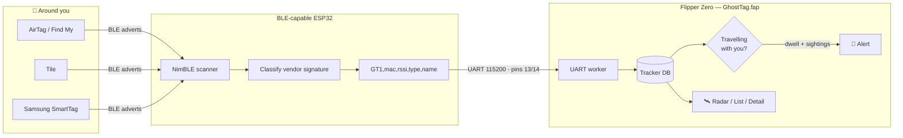
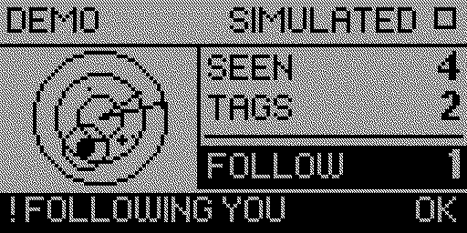

<p align="center">
  <picture>
    <source media="(prefers-color-scheme: dark)" srcset="images/banner-dark.png">
    
  </picture>
</p>

<p align="center">
  <a href="https://github.com/at0m-b0mb/GhostTag-FlipperZero/actions/workflows/build.yml"></a>
  <a href="https://github.com/at0m-b0mb/GhostTag-FlipperZero/releases/latest"></a>
  
  
  <a href="LICENSE">
</a></p>

> **Somebody can buy a tracker for £25 and drop it in your bag.**
> GhostTag watches the Bluetooth advertising channels for the ones that are still
> with you twenty minutes later — and tells you, out loud, when one is.

Detecting a tracker is easy. There is one in nearly every bag on a train, and
almost all of them are innocent. What matters is **persistence**: the tag that
is in range at the station, still in range at the shops, and still in range
outside your front door. That is the only thing GhostTag grades, and it is
careful never to claim more than it measured.

---

## Two ways to run it

|  | What it needs | What it does |
|---|---|---|
| 🛰️ **Hunt** | Flipper + a **BLE-capable ESP32** | The real thing. Identifies AirTags, Tiles, SmartTags and Chipolos, tracks each one over time, and alerts when one travels with you. |
| 👻 **Demo** | **Nothing at all** | A scripted stalking scenario played through the real UI, so you can see exactly what an alert looks like before buying any hardware. Every screen is stamped `DEMO`, and a demo session is never written to the log. |

> **Why isn't there an onboard-only detection mode?** Because the radio cannot
> do it, and we checked rather than assumed — see
> [the onboard radio](#-what-the-onboard-radio-can-and-cannot-do) below.

<p align="center">
  <picture>
    <source media="(prefers-color-scheme: dark)" srcset="images/screens-dark.png">
    
  </picture>
</p>
<p align="center"><sub>Every screenshot in this repository is captured off a real Flipper over the RPC protocol — there are no mockups here.</sub></p>

---

## ⚠️ The official Flipper WiFi Devboard does **not** work

This is the single most important thing on this page, so it is not buried in a
footnote.

The official board is built around an **ESP32-S2**, and the ESP32-S2 has **no
Bluetooth radio of any kind** — not BLE, not Classic. It is Wi-Fi only. No
firmware can give it a radio it does not have. (This is also why the Marauder
project greys out every Bluetooth menu item on that board.)

GhostTag's ESP32 sketch refuses to compile for an S2 rather than handing you a
binary that flashes perfectly and then finds nothing forever.

### Boards that do work

| SoC | Bluetooth | Works? |
|---|---|:--:|
| **ESP32-S3** | BLE 5.0 | ✅ recommended |
| **ESP32-C3** | BLE 5.0 | ✅ recommended, cheap |
| **ESP32** (original) | BT 4.2 + BLE | ✅ |
| **ESP32-C6** | BLE 5.0 | ✅ needs NimBLE 2.x |
| **ESP32-S2** | none | ❌ **no radio** |

**Flipper-shaped add-on boards** (clip straight onto the GPIO):
[ESP32 Marauder Add-On](https://electroniccats.com/store/flipper-add-on-marauder/)
(Electronic Cats, S3) · [WiFi ESP32 Marauder](https://hackerwarehouse.com/product/wifi-esp32-marauder-for-flipper-zero/)
(Hacker Warehouse, S3) · [Flipper Zero ESP32S3 v4](https://www.tindie.com/products/sometoms/flipper-zero-esp32s3-v4-board/)
(Rabbit-Labs).

**Plain dev boards** wired to the GPIO also work: Seeed XIAO ESP32C3/S3,
ESP32-C3-DevKitM-1, ESP32-S3-DevKitC-1, any ESP32-WROOM-32 board.

### Wiring a plain board

| Flipper pin | | ESP32 |
|---|:--:|---|
| `13` TX | → | RX |
| `14` RX | → | TX |
| `11` GND | → | GND |

Note the **TX ↔ RX cross-over**. Power the ESP32 from its own USB while you are
getting started — pin `9` is 3V3 and can run a small module, but the documented
current budget for that rail is not something to guess at with a radio on it.

---

## 🧠 How it works

The Flipper's own Bluetooth is **advertising-only**. `furi_hal_bt.h` exposes a
peripheral profile, advertising, and RF test mode — there is **no GAP observer
role and no way to hand an advertisement to an application**. So the Flipper
physically cannot see a tracker on its own. GhostTag splits the job: the ESP32
is the radio, the Flipper is the brain and the screen.



### 📡 What the onboard radio can and cannot do

`furi_hal_bt.h` also exposes **RF test mode**, which looks like it should let
the Flipper measure raw energy on a channel even though it cannot decode
anything. That would not find trackers, but it would at least answer "how busy
are the advertising channels right here" — useful context, since a tag that
persists in an empty garage means far more than one in a crowded café.

**It was built, and it does not work.** On official firmware (API 87), tested
on a real device:

| Step | Result |
|---|---|
| `furi_hal_bt_ensure_c2_mode(BleGlueC2ModeStack)` | ✅ returns true — the radio core is up |
| `bt_disconnect()` + `furi_hal_bt_stop_advertising()` | ✅ radio released |
| `furi_hal_bt_start_rx(ch)` → `furi_hal_bt_get_rssi()` | ❌ returns `0.0` on **every** sample |
| `furi_hal_bt_start_packet_rx(ch, 1M)` → `get_rssi()` | ❌ returns `0.0` on **every** sample |

A return of exactly `0` is how this stack reports a **failed read**, on both
receive paths, for every sample. So an app gets no energy measurement at all.

The code is kept — it is correct as written and would start working the day a
firmware hands an application a real RSSI — but it is compiled out
(`GHOSTTAG_ENABLE_AIR_CHECK` in `ghosttag_i.h`) rather than shipped as a menu
entry that can only ever read `NO READING`. If you are working on a firmware
where this behaves differently, flip that define and please open an issue.

### What "travelling with you" actually means

A record is promoted only when **all three** hold:

1. it is a **known tracker type** that could realistically be used to stalk someone;
2. it has been heard **at least 4 times**; and
3. it has been **in range continuously** for the whole dwell window you set.

"Continuously" is load-bearing. If a tag goes quiet for 30 seconds, its dwell
clock **restarts**. Without that, a tag you passed twice ten minutes apart
satisfies any dwell window up to ten minutes — and telling somebody they are
being followed when a tag merely passed them twice is the worst thing this app
could do.

### Reading the dial



**Distance from the centre is real.** It is the measured signal strength,
mapped onto the range rings.

**The angle is not a bearing.** There is no compass and no antenna array in a
Flipper Zero, so it cannot know which direction anything is in. The angle is a
stable hash of the device address, so each tag keeps its own spot and you can
watch it move in and out — and that is all it means. That is also why there is
no crosshair: a cross through the middle reads as N/E/S/W.

A **hollow pulsing ring** is a tracker that has been promoted. A **solid dot**
is a tracker that has not. A **single pixel** is ambient kit that is not a
stalking risk at all.

<br clear="right">

---

## 🚀 Install

### The Flipper app

**Grab a build** — download from [Releases](https://github.com/at0m-b0mb/GhostTag-FlipperZero/releases)
and copy to `SD Card / apps / Bluetooth /` with [qFlipper](https://flipper.net/update).

> Two builds are attached to every release, because a `.fap`'s API version is
> baked in at compile time:
> * `ghosttag.fap` — **official** firmware (API 87)
> * `ghosttag-fw-dev.fap` — **Momentum / Unleashed / RogueMaster** (API 88)
>
> Using the wrong one gives you `APP:87 < FW:88 — This app might not work`.

**Or build it:**

```bash
python3 -m pip install --upgrade ufbt
git clone https://github.com/at0m-b0mb/GhostTag-FlipperZero.git
cd GhostTag-FlipperZero
ufbt          # builds dist/ghosttag.fap
ufbt launch   # build, upload to a connected Flipper, and run it
```

Open **Apps → Bluetooth → GhostTag**. You can run **Demo** immediately — no
hardware at all.

### The ESP32 sketch

1. Arduino IDE + the **ESP32 board package** (`esp32` by Espressif).
2. Library Manager → **`NimBLE-Arduino`**. Either **1.4.x** or **2.x** works;
   the sketch detects which and compiles against the right scan-callback API.
   *(C6 needs 2.x.)*
3. Open [`esp32/ghosttag_esp32/ghosttag_esp32.ino`](esp32/ghosttag_esp32/ghosttag_esp32.ino),
   pick your board, upload.

On boot it prints `GTHELLO,2.0` and heartbeats `GTALIVE` every two seconds, so
the Flipper can tell *"the board is fine and the room is quiet"* apart from
*"the board is dead"* — which it could not do before v2.0.

---

## 🎯 Using it

| Screen | Keys |
|---|---|
| **Radar** | `OK` detections · `←` help · `Back` end the hunt |
| **Detections** | `↑ ↓` scroll · `OK` open · `Back` return |
| **Detail** | `← →` previous / next tracker · `Back` return |
| **Alert** | `OK` details · `Back` dismiss |

Then: **walk.** A tracker that stays with you across a few minutes of real
movement is the signal; one that is merely nearby is not. Pop back into
**Detections** now and then — the dwell column is the one that matters.

### Settings

| Setting | Options | What it does |
|---|---|---|
| **Range** | Near · Medium · Far | RSSI cutoff. *Near* (~5 m) ignores the room next door. |
| **Alert after** | 1 / 3 / 5 / 10 min | How long a tag must stay before it is called a follower. |
| **Sound · Vibrate · LED** | On · Off | Which alert channels fire. |
| **Screen on** | On · Off | Hold the backlight for a long hunt. |
| **Log to SD** | On · Off | Append findings to `apps_data/ghosttag/sessions.csv`. Capped at 64 KB. Demo sessions are **never** logged. |

Settings persist across restarts. That is a safety feature as much as a
convenience: somebody who turns **Sound** off because they do not want a stalker
to hear the alert should not have it switch itself back on.

---

## 🔬 Detection signatures

| Tracker | Signature | Code |
|---|---|:--:|
| Apple Find My — **separated** | manufacturer `0x004C`, type `0x12`, length ≥ `0x19` | `1` |
| Apple — owner nearby | `0x004C`, type `0x12` short form, or `0x07` / `0x10` | `2` |
| Tile | service UUID / service data `0xFEED` | `3` |
| Samsung SmartTag | service data UUID `0xFD5A` (SmartThings Find) | `4` |
| Chipolo | manufacturer `0x0157` (ONE Spot rides Find My → `1`) | `5` |

Two deliberate decisions in there:

* **The Find My length byte is the whole ballgame.** The long form is the
  *separated* state — the tag has lost its owner and is broadcasting a rotating
  key for any passing phone to relay. That is the state a tag planted on
  somebody is in. The short form means the owner is standing right there, and
  is graded harmless.
* **Samsung's company ID `0x0075` is deliberately not used.** It is on every
  Samsung phone, watch, TV and pair of earbuds in the room. Matching it
  reported half a train carriage as SmartTags.

### UART line protocol

```
ESP32  → Flipper :  GT1,<mac12hex>,<rssi>,<typecode>,<name>
                    GTHELLO,<version>      on boot and in reply to PING
                    GTALIVE,<count>        heartbeat, every 2 s
Flipper → ESP32  :  START    STOP    PING
```

Plain ASCII on purpose — you can watch it in any serial monitor while debugging.

---

## ⚠️ What it cannot do

An anti-stalking tool that overstates itself is worse than none, so:

* **It cannot tell you a direction.** No compass, no antenna array. The radar
  angle is decorative and the app says so on its own help screen.
* **It cannot prove intent.** "Travelling with you" means *in range across
  time*, nothing more. A tag on a shelf you stood next to for ten minutes looks
  identical to one in your coat pocket. Walk, and re-check.
* **Find My tags rotate their address** roughly every 15 minutes, so a long
  tail may appear as several shorter records rather than one long one.
* **A quiet result is not an all-clear.** GhostTag hears BLE advertising. A
  tracker that is switched off, out of range, or not beaconing is invisible to
  it — as is anything that is not Bluetooth at all.

---

## 🗺️ Roadmap

- [ ] "Make it chirp" for separated AirTags, to find one you have detected
- [ ] GPS devboard support, to confirm a follower against real movement
- [ ] Correlate rotating addresses by payload so one stalk is one record
- [ ] Native internal-BT backend if a firmware ever exposes BLE observer mode

---

## 🛠️ Repo tooling

Everything below runs on a laptop and is wired into CI, because three of these
caught real bugs in the rewrite:

| Tool | What it does |
|---|---|
| `tools_check_layout.py` | Measures every on-screen string against the 128 px width and the 64-row height, including both branches of a ternary — which is how `"SIMULATED - not real"` was caught running 18 px off the edge of a real device. |
| `tools_strict_build.py` | Compiles with 14 warnings the SDK does not enable, plus per-function stack frames. Found three GUI-thread functions each burning 2.1 KB of stack. |
| `tools_screenshot.py` | Drives the app over the Flipper's protobuf RPC and captures real frames. No mockups. |
| `tools_gen_banner.py` | Renders the brand assets, with the safe border asserted rather than eyeballed. |
| `tools_brand_data.py` | Reads the banner's numbers out of the C, so nothing is typed twice. |

---

## 🛡️ Responsible use

GhostTag is a **defensive, anti-stalking privacy tool**. Use it to find
trackers placed on **you** or your property, or with the consent of everyone
involved. Do not use it to harass or surveil anyone. You are responsible for
the laws where you are.

Everything runs locally on your own hardware. No cloud, no account, nothing
leaves the device.

---

## 🙏 Credits

Flipper Zero [developer docs](https://developer.flipper.net/) ·
[NimBLE-Arduino](https://github.com/h2zero/NimBLE-Arduino) ·
prior art that informed the approach:
[AirGuard](https://github.com/seemoo-lab/AirGuard),
[ESP32-AirTag-Scanner](https://github.com/MatthewKuKanich/ESP32-AirTag-Scanner),
[ESP32Marauder](https://github.com/justcallmekoko/ESP32Marauder)

## 📄 License

[MIT](LICENSE) © [at0m-b0mb](https://github.com/at0m-b0mb)

<p align="center"><sub>Built for people who would rather know. 👻</sub></p>
