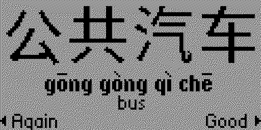
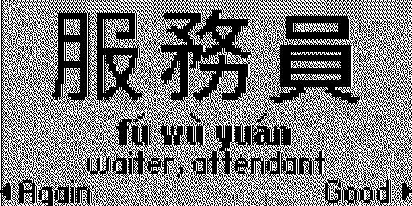
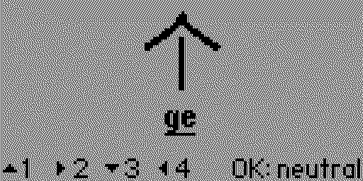
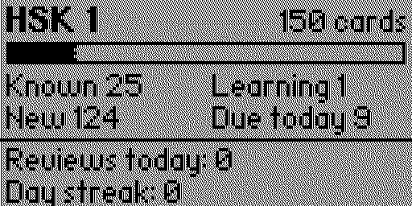
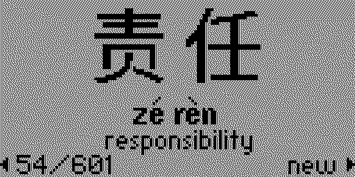

# Hanzi Cards

Mandarin flashcards for the [Flipper Zero](https://flipperzero.one): simplified or traditional characters, pinyin with tone marks, and the tones played on the speaker.





 



## What it does

- **Decks:** HSK 1 (150 words), HSK 2 (156), HSK 3 (292) and HSK 4 (601), plus four small themed decks: Numbers and time, Food, Travel and Measure words. Each has its own progress. HSK 1 and 2 are in a rough learning order; HSK 3 and 4 are shuffled.
- **Characters:** simplified or traditional, switchable at any time.
- **Flashcards:** the front shows the characters. Flip it to see the pinyin and the English.
- **Tone quiz:** instead of flipping, pick the tone of each syllable with the D-pad. The card then shows the right answer with any wrong syllables inverted, and is marked Good only if every tone was right.
- **Tone sound:** on a flip, the speaker glides through each syllable's tone contour (high and flat, rising, dipping, falling), so you hear the shape of the word.
- **Spaced repetition over days:** a card you know comes back after 1, 3, 7, 14, 30 and then 60 days; a card you miss comes back the same day until you get it. It uses the Flipper's clock, so set the date.
- **Daily limit:** 5, 10, 20 or 50 new cards a day. When nothing is due the app says so, and OK lets you carry on with more new cards or review ahead.
- **Stats:** known, learning and new counts for the deck, cards due today, reviews today and your day streak.
- **Browse:** page through the whole deck with pinyin and English, without touching your progress.
- **Saving:** progress is saved to the SD card. Progress from earlier versions is kept, with its cards spread over the coming days.

## Controls

| Button | Action |
| --- | --- |
| OK | Flip the card; once flipped, play the tones again |
| Left | Again: you missed it |
| Right | Good: you knew it |
| Back | Flip the card back over |
| Hold OK | Settings |
| Hold Back | Save and quit |

### Tone quiz

| Button | Tone |
| --- | --- |
| Up | 1st: high and flat |
| Right | 2nd: rising |
| Down | 3rd: dipping |
| Left | 4th: falling |
| OK | Neutral |
| Back | Take back the last pick |

After the last syllable the answer is shown: OK moves on, Up plays the tones again. Answers follow the dictionary tones in the deck, so tone changes in speech (such as two third tones in a row) are not applied.

### Browse

Left/Right step through the deck (hold to keep going), Up/Down jump ten cards, OK plays the tones and Back returns to your cards. The corner shows whether a card is new, due, or how many days until it is due.

## Settings

| Setting | Values |
| --- | --- |
| Deck | HSK 1 to 4, Numbers, Food, Travel or Measures |
| Mode | Flashcards or Tone quiz |
| Characters | Simplified or Traditional |
| Front | Hanzi or English (flashcards only) |
| Tone sound | On or Off |
| New cards a day | 5, 10, 20 or 50 |
| Stats | Shows the deck's stats |
| Browse deck | Opens the deck browser |
| Reset progress | Press twice to clear the current deck's progress |

## Adding words

Decks are built from the tab-separated lists in `decks/` (simplified, traditional, numbered pinyin, English). Edit a list and rebuild its deck file:

```bash
python tools/build_deck.py decks/hsk1.tsv assets/hsk1.deck
```

The script needs [Pillow](https://python-pillow.org) and the fonts `NotoSansCJKsc-Regular.otf` and `NotoSansCJKtc-Regular.otf` from [noto-cjk](https://github.com/notofonts/noto-cjk/tree/main/Sans/OTF) in a `fonts/` folder (or pass `--font` and `--trad-font`). A new deck also needs an entry in the `decks` table in `hanzi_cards.c`.

## Build and install

You need [ufbt](https://github.com/flipperdevices/flipperzero-ufbt), the Flipper app build tool:

```bash
python3 -m pip install --upgrade ufbt
```

With the Flipper connected over USB (and qFlipper closed), build, install and start the app:

```bash
ufbt launch
```

It installs to `Apps → Tools → Hanzi Cards`.

## License

[MIT](LICENSE). The character bitmaps in `assets/` are rendered from Noto Sans CJK, which is licensed under the [SIL Open Font License](https://openfontlicense.org).
