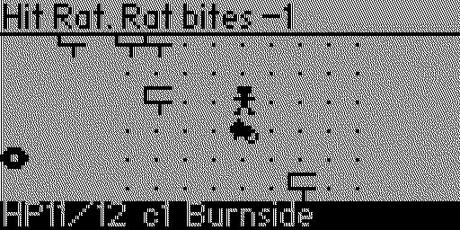
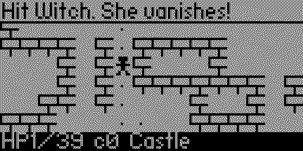
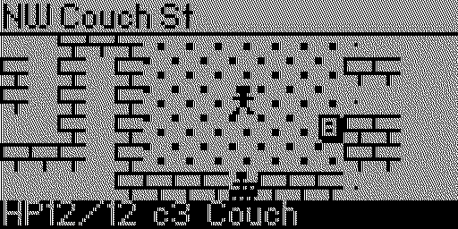
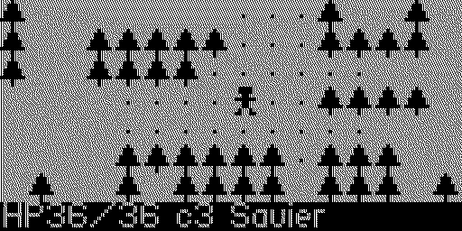
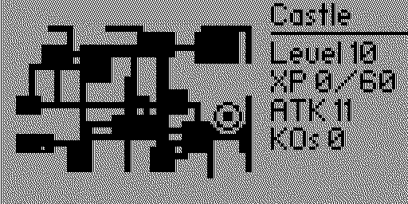
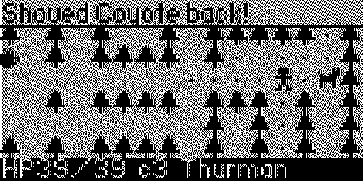

# NW Crawl

A tiny roguelike for the [Flipper Zero](https://flipperzero.one), set on the alphabet streets of NW Portland.





 

 

Start on Burnside and head north one street per floor (Couch, Davis, Everett, Flanders ... Thurman) until you reach the Witch's Castle in Forest Park.

## The game

- **Floors:** 19 streets plus the castle. Each is a randomly generated maze of rooms, corridors and side alleys with fog of war. The up-arrow tile leads to the next street.
- **Neighbourhoods:** the southern blocks are wide and open, the northern industrial streets are long corridors, and the last two streets run through the trees of Forest Park.
- **Locals:** tougher ones show up the further north you go.
  - Rats just bite.
  - Crows fly over walls and never fly straight.
  - Raccoons swipe a coffee and run; catch one to get it back.
  - E-scooters charge up to three tiles when they have a straight run at you. Step out of line.
  - Coyotes come in pairs, and once one spots you the whole pack knows where you are.
- **Sasquatch:** lurks by the exit on the northern streets. You can't see him until he's two tiles away. The first time you beat him he drops his slingshot; after that he shows up less often and drops a donut or an IPA.
- **Pickups:**
  - Coffee is carried with you and heals 5 HP when you drink it.
  - A pink-box donut raises your max HP.
  - A hazy IPA raises your attack.
  - A used book reveals the floor's map.
- **Umbrella:** lying on NW Davis (and on every later street until you pick it up). Press Back, then a direction, to shove the local standing there two tiles back and stun it for a turn. One with its back to a wall is slammed for a little damage instead. Sasquatch is too big to shove, and the Witch can be pushed but not stunned.
- **Slingshot:** Sasquatch carries it, and he turns up on every northern street until you beat him and take it. Press Back, then a direction, to fire a pebble up to five tiles in a straight line. Pebbles come in piles of three on every street and you can carry nine.
- **Landmarks:** safe rooms with a checkered floor. Walk into the shopfront in the wall to use it.
  - **Powell's Books** on Couch always has a used book, and the clerk sells a trail guide for 2 coffees. With the guide every later street starts mapped, and used books give XP instead.
  - **Food carts** on Kearney trade 4 XP for a full heal, as often as you can pay.
  - **The streetcar** on Lovejoy carries you two streets north to Northrup, skipping Marshall.
  - **Joe's Cellar** on Pettygrove: one stiff pour from the bartender (full HP and +1 attack).
- **The Witch:** she hexes you from range, summons crows and vanishes when hit.
- **Saving:** the walk is saved each time you reach a new street. Quit and the title screen offers to continue from the start of that street. Dying or winning ends the saved walk.
- **Records:** the title screen shows the furthest street you have reached, then your win count and fastest win once you have beaten the Witch.
- **Sound:** square-wave effects that follow the Flipper's volume setting.

## Controls

| Button | Action |
| --- | --- |
| D-pad | Move; walk into something to attack it |
| OK | Drink a coffee, or wait a turn at full health |
| Hold OK | Street map and character sheet; any button closes it |
| Back, then a direction | Swing the umbrella at a local next to you, otherwise fire the slingshot. Back or OK cancels |
| Down (title) | Choose between continuing a saved walk and starting a new one |
| Hold Back | Quit |

## Dev mode

Press Up on the title screen to toggle dev mode, then Left/Right to pick the starting street and OK to start there. You begin with a character scaled to roughly what a real run would have by that point (including the umbrella and, far enough north, the slingshot) and with the street already mapped, and the end screens return to the title so you can pick another street. Dev runs are never saved and set no records.

## Build and install

You need [ufbt](https://github.com/flipperdevices/flipperzero-ufbt), the Flipper app build tool:

```bash
python3 -m pip install --upgrade ufbt
```

With the Flipper connected over USB (and qFlipper closed), build, install and start the game:

```bash
ufbt launch
```

It installs to `Apps → Games → NW Crawl`. To build without a device, run `ufbt` and copy `dist/nw_crawl.fap` to `apps/Games` on the SD card.

## License

[MIT](LICENSE)
