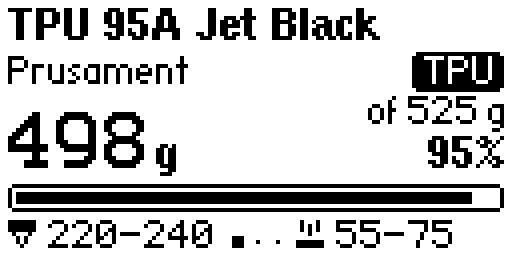
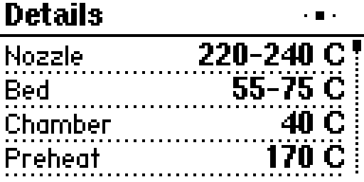
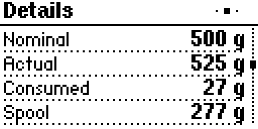
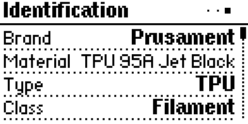
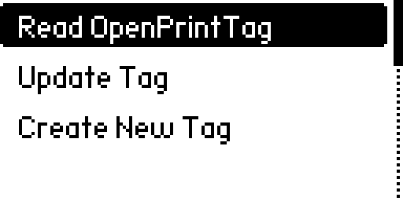
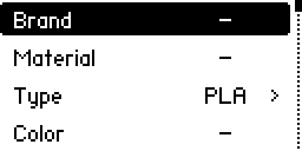

# OpenPrintTag for Flipper Zero

Read, update and create OpenPrintTag NFC tags on 3D printing filament spools with your Flipper Zero.

[OpenPrintTag](https://openprinttag.org/) is an open standard by Prusa Research that stores information about a printing material on an NFC-V (ISO 15693) tag: brand, material, type, color, temperatures, weights and how much of the spool is used up. This app is an independent community project and is not affiliated with Prusa Research.

## What it does

**Read OpenPrintTag** shows what is on a tag, in three pages. Left and Right switch between them, Up and Down scroll.

- Summary: material, brand and type, the remaining weight with a progress bar, nozzle and bed temperatures
- Details: temperatures, weights, lengths, diameter, density, drying and color
- Identification: brand, material, type, GTIN, UUID, dates and the tag UID

**Update Tag** changes how much material has been consumed. Read the tag, then set the total consumed weight (Left and Right change it by 20 g, OK types an exact value) or add an amount to it, and save. You can edit the value away from the tag and hold the tag on the Flipper afterwards. The app writes only the auxiliary region, keeps every other field in it as it is, and checks every block by reading it back.

**Create New Tag** writes a new OpenPrintTag onto a tag. Fill in the brand, material name, type, color, filament diameter, weights and temperatures, then hold the tag on the Flipper. If the tag already has data, the app asks before replacing it. The tag is laid out as the specification describes: the message fills the tag and the auxiliary region starts on a block boundary.

## What you need

- A Flipper Zero with the latest release firmware
- OpenPrintTag tags, or blank NFC-V tags with at least 320 bytes of memory such as ICODE SLIX2

## Good to know

- Tags can be write protected by their manufacturer. The app does not use passwords and cannot change protected areas.
- The app does not lock tags or set write protection.
- Only the fields a Flipper screen can show are read. Unknown fields on a tag are never removed.
- Creating a tag writes the whole tag. Use a tag you are happy to overwrite.

## Build from source

Build with [ufbt](https://pypi.org/project/ufbt/): run ufbt in the project folder, and ufbt launch to install and start it on a connected Flipper.

See docs/development.md for the project layout and how the tag format is handled.

## License

MIT, see the LICENSE file. The OpenPrintTag specification is by Prusa Research a.s. and is also MIT licensed.
