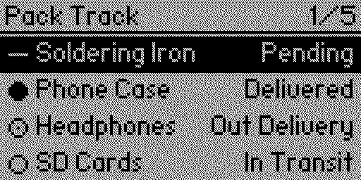
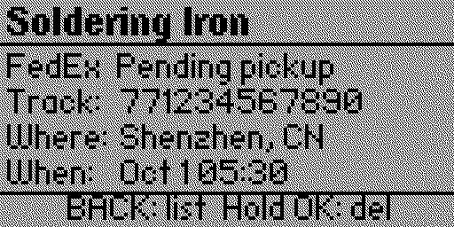
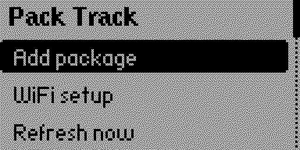

# Pack Track

A shipment tracker for the Flipper Zero. Add a tracking number on the device,
and with a WiFi devboard attached the app fetches real status by itself — a
glanceable list on a 128×64 monochrome display, and a detail view with carrier,
tracking number, last known location and the time of the last scan.





Nothing is hosted by this app, and there is no account to create with anyone
except the tracking service you choose. Your API key and your WiFi credentials
stay with you.

## What you need

**For live tracking:**

- A **WiFi devboard running [FlipperHTTP](https://github.com/jblanked/FlipperHTTP)**.
  A Flipper Zero has no internet of its own, so this is not optional.
- **Your own API key** from a tracking service. The app knows the settings for
  [Trace](https://traceapi.dev/) — free tier is 1,000 lookups a month with no
  card — and any other JSON service can be configured by hand.

**Without a devboard**, Pack Track still works as a shipment list you maintain
yourself, status included. The setup below simply does not apply.

## Setting up

All of it happens on the Flipper. Press **LEFT** on the list to open the menu.

### 1. WiFi

**Menu → WiFi setup.** The board scans, the app shows the networks it found,
you pick yours and type the password once.

The board joins the network and stores the credentials in its own flash, so the
password never touches your SD card and the board reconnects by itself from then
on.

### 2. Tracking service

Sign up at [traceapi.dev](https://traceapi.dev/) and create an API key — it
starts with `trc_`.

**Menu → Tracking setup**, then type the key. The app writes the rest of the
configuration itself.

Typing a long key on the on-screen keyboard is tedious; to paste it instead, see
[Configuring another service](#configuring-another-service) and edit `config.txt`
from your computer. Holding **OK** on the keyboard inverts the case of a letter,
which is the only way to type a lowercase first character.

### 3. Packages

**Menu → Add package**, then enter the tracking number, a label and a carrier.

The service detects the carrier from the tracking number, so the carrier field is
only a label for your own benefit.

That is the setup. The app fetches when it opens, and **Menu → Refresh now**
forces a refresh at any time.

## Controls

| Screen | Input | Action |
|--------|-------|--------|
| List | ▲ / ▼ | Move selection (scrolls automatically beyond four rows) |
| List | OK | Open detail view for the highlighted shipment |
| List | ◀ | Open the menu |
| List | ▶ | Refresh all |
| List | BACK | Exit |
| Detail | ◀ / ▶ | Page between shipments |
| Detail | Hold OK | Delete this package (asks first) |
| Detail | BACK | Return to the list |
| Refreshing | BACK | Cancel the refresh |

## Status glyphs

| Status | Glyph |
|--------|-------|
| Delivered | filled dot |
| Out for Delivery | ringed dot |
| In Transit | hollow ring |
| Pending | dash |
| Exception | ✕ |

Drawn procedurally — no bitmap assets.

## Limitations

**Amazon's own deliveries are not supported.** Tracking numbers beginning with
`TBA` belong to Amazon Logistics, which does not publish tracking data that
third-party services can read. Amazon orders shipped via UPS or USPS carry those
carriers' numbers instead, and those work normally.

A lookup only succeeds when the service can find dated carrier events. A number
created moments ago, or one the carrier has not scanned yet, may return nothing
until it enters the network.

Your API key is stored in plain text in `config.txt` on the SD card. Fine for a
personal device; not a card to lend out.

## Configuring another service

Pack Track is not tied to Trace. **Menu → Tracking setup** just writes a
known-good configuration, and `apps_data/package_tracker/config.txt` can be
edited by hand for any service that takes a tracking number and answers with
JSON:

```
METHOD = POST                       # or GET, the default
URL = https://api.example.com/track # {tracking} and {carrier} are substituted
HEADER = Authorization: Bearer YOUR_KEY
HEADER = Content-Type: application/json
BODY = {"tracking_number":"{tracking}"}
FIELD_STATUS = status
FIELD_LOCATION = events.last.location
FIELD_UPDATED = events.last.timestamp
```

Field paths use dots for object keys, numbers for array indices
(`data.0.status`), and `last` for the final element of an array — which is how
most services expose the most recent event in a timeline.

Status text is matched loosely, so `delivered`, `Delivered`, `in_transit` and
`In Transit` all map onto the right glyph.

Up to four headers are supported, and up to 12 packages.

## Where things are kept

```
SD card: /apps_data/package_tracker/
  packages.txt   your shipments, written by the app
  config.txt     the tracking service settings
```

`packages.txt` is a plain pipe-separated list and can be edited from a computer
if you prefer:

```
Label | Carrier | Tracking | Status | Location | Updated
```

Lines beginning with `#` are comments. Changes are picked up the next time the
app opens.

## Building

```bash
ufbt            # build
ufbt launch     # build, upload and run on a connected Flipper
```

## Project layout

```
.
├── application.fam        # FAP manifest
├── package_tracker.c      # UI, event loop, refresh worker
├── tracker_util.c/.h      # config, templating, JSON extraction (host-testable)
├── http.c/.h              # FlipperHTTP client over the GPIO UART
├── prompt.c/.h            # on-screen keyboard
├── menu.c/.h              # list picker
├── catalog_description.md # store description
├── changelog.md
├── LICENSE
└── README.md
```

## License

Released under the [MIT License](LICENSE).
