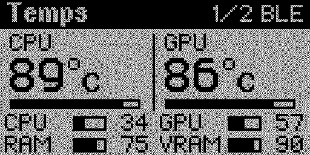
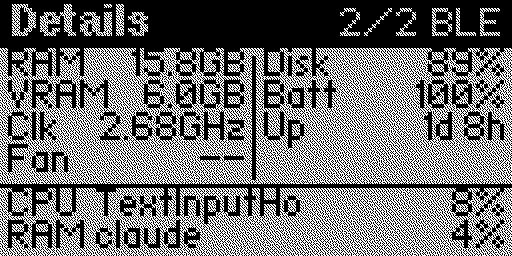
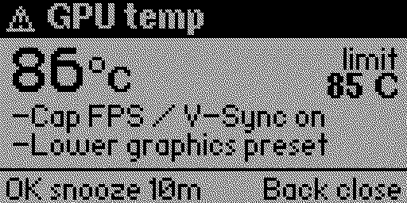
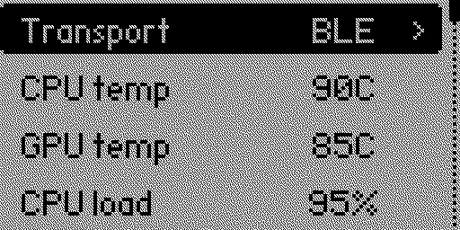
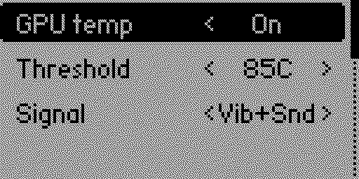

# PC Health Remote

**Температуры и нагрузка вашего ПК на Flipper Zero, с оповещениями вибро, звуком и светодиодом.**

  
  
  
  
  

[English](README.md) | Русский

Проект состоит из приложения для Flipper Zero (`pc_health_remote`, категория Bluetooth) и небольшой программы
для ПК (`pc-health-remote.exe`, Rust, значок в трее Windows; Linux - по возможности), которая шлёт показатели
на Flipper по Bluetooth LE или USB.

## Возможности

* Страница "Temps": температура CPU и GPU, нагрузка CPU, GPU, RAM и VRAM.
* Страница "Details": объём RAM/VRAM, частота CPU, вентилятор, заполнение диска, батарея, аптайм,
  самые "тяжёлые" процессы по CPU и RAM.
* Оповещения с настраиваемым порогом и сигналом (Vibro, Sound, Vib+Snd, LED, Off) для каждого правила:
  температура CPU 90 C, GPU 85 C, нагрузка CPU 95 % в течение 30 с, нагрузка GPU (по умолчанию выключено),
  RAM 90 % в течение 10 с, VRAM 95 %, диск 95 %, низкий заряд 20 % при работе от батареи,
  потеря связи с ПК 10 с. На экране оповещения - значение и лимит и 2 подсказки; OK откладывает на 10 минут,
  Back закрывает.
* Транспорт: Bluetooth LE (по умолчанию) или USB. Настройки хранятся на SD-карте.
* Прошивки: официальная (API 87.1, fw 1.4.3) и RogueMaster (API 88.4).

Температура CPU берётся из LibreHardwareMonitor (если запущен; точнее всего), иначе из термозоны ACPI Windows.
GPU - через NVIDIA NVML (только NVIDIA, для остальных будет `--`). Обороты вентилятора - только через
LibreHardwareMonitor.

## Быстрый старт

Подробно: [docs/SETUP.md](docs/SETUP.md) (на английском).

1. Установите приложение на Flipper: `pc_health_remote.fap` из
   [релизов](https://github.com/vladatman/pc-health-remote/releases) в `/ext/apps/Bluetooth/` (например, через
   qFlipper, "Install from file") или из каталога приложений.
2. Скачайте exe для ПК со страницы [релизов](https://github.com/vladatman/pc-health-remote/releases)
   и положите в постоянную папку.
3. Один раз выполните сопряжение: откройте приложение на Flipper и в PowerShell запустите
   `.\pc-health-remote.exe pair`. На Flipper появится "Verify code" - нажмите OK на Flipper.
   Windows ничего не покажет. Дальше подключение происходит автоматически и без запросов, когда приложение открыто.
4. Запустите `.\pc-health-remote.exe` (значок в трее).
5. Автозапуск: один раз из PowerShell **от администратора** выполните `.\pc-health-remote.exe install`
   (задача в Планировщике при входе в систему, с наивысшими правами). Удаление: `uninstall`.

Для точной температуры CPU и оборотов вентилятора запустите LibreHardwareMonitor (в автозагрузке).
Если связи нет: `pc-health-remote.exe unpair`, затем снова `pair`. Логи: `%APPDATA%\pc-health-remote\`.

Протокол: [docs/PROTOCOL.md](docs/PROTOCOL.md). Лицензия: [MIT](LICENSE).
