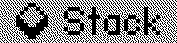
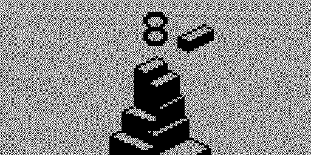
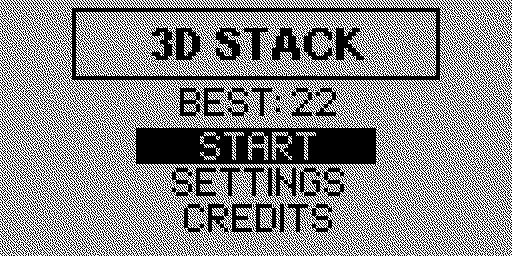
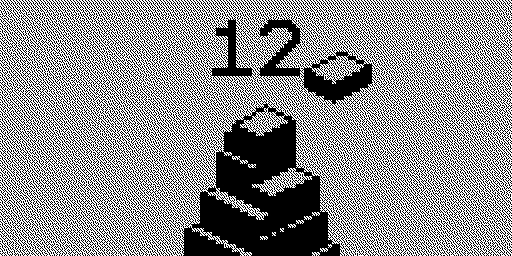

# Stack

**Stack** is a classic skill and timing game where you layer falling blocks on top of each other to build the tower as high as possible. 

High scores are saved to Flipper Zero's SD card, and the gaming experience has been enhanced with vibration, dynamic sound effects, and LED lighting during gameplay!

---

## screenshots from the app

   ‎‎  ‎ ‎  ‎ 
   ‎‎  ‎ ‎ ‎  ‎ 
    

---

<!-- Badges -->

---

##  Controls

| Button | Action |
| :--- | :--- |
| **Up / Down** | menu selection |
| **OK** | main game button  |
| **Back** | exit |

---

