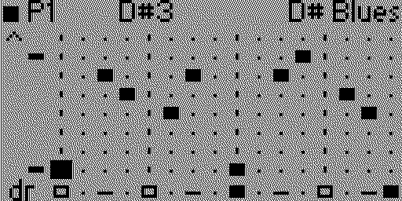
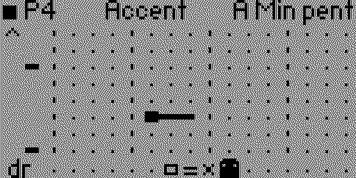
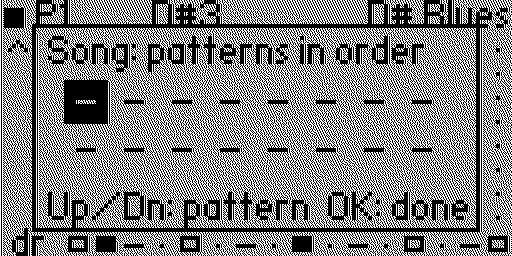

# Step Seq

A step sequencer for the [Flipper Zero](https://flipperzero.one)'s piezo speaker, with a melody grid and a drum row.



 

## What it does

- **Melody:** one note per step across 15 pitch rows. Rows follow the chosen scale, so everything stays in key.
- **Note length:** a note can be short, one step, or held for 2, 3, 4, 6 or 8 steps. A held note stops early if another note starts.
- **Accents:** an accented note or drum plays one volume level louder, and an accented note starts with a quick blip an octave up so it still stands out at full volume.
- **Chords:** the speaker has one voice, so a chord is played chiptune-style by cycling quickly through its notes. A note can add its octave, its fifth, or a three-note chord built from the scale.
- **Drums:** kick, snare, hi-hat, open hat, clap and tom on the bottom row, made from square-wave sweeps and noise.
- **One voice:** a drum takes the first few milliseconds of its step and the note gets the rest.
- **Patterns:** eight slots, each 16 or 32 steps, with its own tempo, swing, scale, root and octave.
- **Song:** up to 16 places, each playing one of the patterns, looped in order.
- **Scales:** minor and major pentatonic, minor, major, blues and chromatic, in any root.
- **Editing tools:** transpose, shift left or right, random melody, and one level of undo.
- **Export:** writes the melody as a Flipper music file that the built-in Music Player can play.
- **Saving:** all patterns and the song are saved to the SD card when you quit.

## Controls

| Button | Action |
| --- | --- |
| D-pad | Move the cursor; up/down also previews the pitch |
| Down on the drum row | Pick the next drum sound (shown in the top bar) |
| OK | Place or remove a note; on the drum row, place or remove the chosen drum |
| Back | Play / stop |
| Hold OK | Open settings |
| Hold Back | Save and quit |

### What OK does

The first setting, **OK sets**, chooses what OK changes on the grid. The top bar shows the tool when it is not Note.

| Tool | OK on a step |
| --- | --- |
| Note | Places or removes a note or drum |
| Accent | Turns the accent on or off for the step's note, or for its drum on the drum row |
| Length | Steps through one step, short, then 2, 3, 4, 6 and 8 steps |
| Chord | Steps through none, octave, fifth and triad |

Accent, Length and Chord act on the note already on that step, whichever row the cursor is on.

### Reading the grid

- A note is a block. A short note is a narrow block, a long note has a tail, and an accented note fills its whole cell.
- One, two or three holes in a block mean an octave, fifth or triad chord.
- Drums: a filled block is a kick, a hollow block is a snare, a dash is a hi-hat, two dashes are an open hat, a cross is a clap and a round blob is a tom. A bar above a drum is an accent.
- In a 32-step pattern the screen shows 16 steps at a time and follows the cursor; the two blocks in the top bar show which half you are on.

## Settings

| Setting | Values |
| --- | --- |
| OK sets | Note, Accent, Length or Chord |
| Pattern | 1 to 8 |
| Play | Pattern (loop this one) or Song |
| Edit song | Opens the song editor |
| Tempo | 60 to 240 bpm |
| Swing | Off, or 54% to 70% |
| Length | 16 or 32 steps |
| Scale, Root, Octave | The key the pitch rows follow |
| Volume | 1 to 5, shared by all patterns |
| Transpose | Moves every note down (Left) or up (Right) a row |
| Shift steps | Rotates the pattern a step left or right |
| Random melody | Replaces the melody with a random one in the scale; drums are kept |
| Undo | Takes back the last edit; again to redo it |
| Copy to next | Copies this pattern into the next slot and switches to it |
| Clear pattern | Empties the current pattern |
| Export .fmf | Writes a music file for the Music Player |

Use Left/Right to change a value. Actions marked "press >" run when you press Right.

## Song

In the song editor, Left/Right pick one of 16 places and Up/Down choose the pattern that plays there (a dash is an empty place and is skipped). Set **Play** to Song and press Back: the patterns play in order and loop, each at its own tempo, and the grid follows along.

## Export

**Export .fmf** writes `music_player/StepSeq_P1.fmf` (for pattern 1, and so on) or, when Play is set to Song, `music_player/StepSeq_Song.fmf`. Open it in Apps, Media, Music Player.

The music format holds a single melody, so drums, chords, accents and swing are left out, a song uses its first pattern's tempo, and a held note whose length the format cannot write is rounded down with a rest.

## Build and install

You need [ufbt](https://github.com/flipperdevices/flipperzero-ufbt), the Flipper app build tool:

```bash
python3 -m pip install --upgrade ufbt
```

With the Flipper connected over USB (and qFlipper closed), build, install and start the app:

```bash
ufbt launch
```

It installs to `Apps → Media → Step Seq`. To build without a device, run `ufbt` and copy `dist/step_seq.fap` to `apps/Media` on the SD card.

## License

[MIT](LICENSE)
