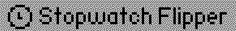
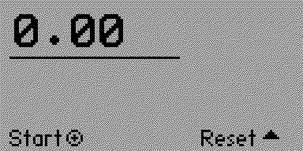
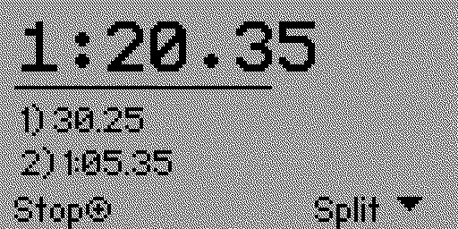

# ⏱️ Stopwatch Flipper

Simple and clean stopwatch application with split lap timing for **Flipper Zero**. 

track time with millisecond precision, record lap splits, and reset with a clean, intuitive layout

---

## screenshots from the app

  
  &nbsp;&nbsp;&nbsp;&nbsp;
  

---

<!-- Badges -->

---

## Controls

| Button | Action |
| :--- | :--- |
| **OK** | start / stop stopwatch |
| **Down** | record split lap (when running) |
| **Up** | reset stopwatch (when stopped) |
| **Back** | exit |
