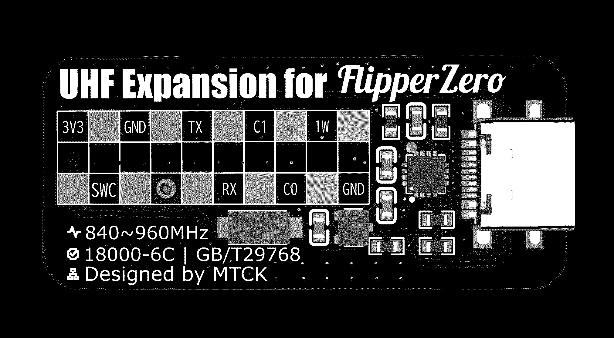
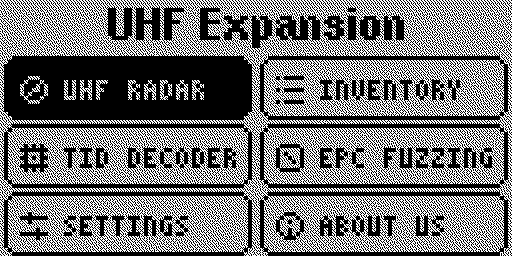
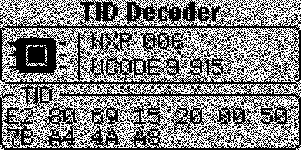
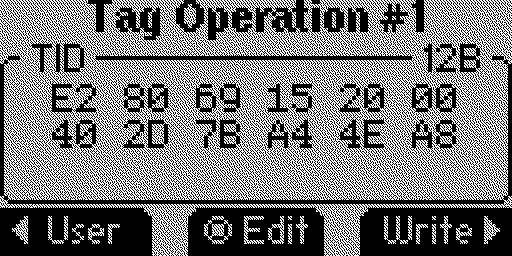
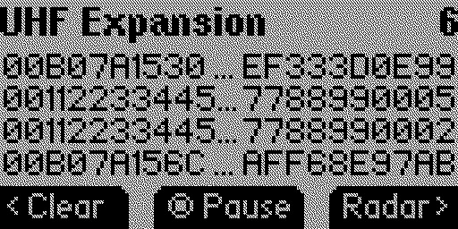
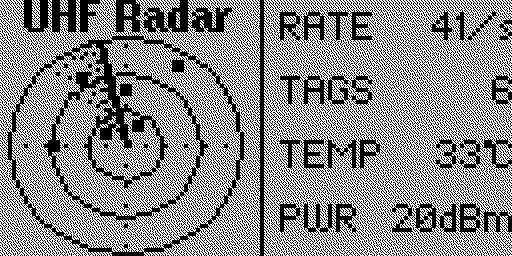
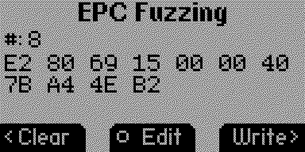

# UHF Expansion

UHF RFID Reader/Writer expansion for Flipper Zero, communicating over UART bridge.



**Available in the official Flipper Apps Catalog:**
[Install UHF Expansion](https://lab.flipper.net/apps/uhf_expansion)

## Features

- **Inventory Scan** — Fast UHF tag scanning with real-time display
- **Feature Menu** — Opens after reader detection with six focused entries
- **TID Decoder** — Automatically pauses on one tag and shows scrollable MDID/model details
- **EPC Fuzzing** — Generates incremental EPC variants with explicit verified writes
- **EPC ASCII** — Captures one tag, edits up to 12 printable ASCII characters, and writes a 96-bit EPC
- **Persistent Settings** — Configure sound, 0–20 dBm RF power, EPC display, and a startup tool
- **Paged EPC List** — Browse scanned tags page by page, with truncated preview
- **Tag Details** — View full EPC, RSSI, and PC (Protocol Control) bits for each tag
- **Tag Memory Actions** — Read and write EPC, TID, and User Data on compatible tags
- **Tag Protection Actions** — Erase writable banks and reversibly lock or unlock EPC, TID, and User memory
- **Access Keys** — Keep four reusable 32-bit access-password slots in the app data directory
- **Save CSV Records** — Export scanned tags to CSV file on SD card
- **About Page** — Version info and project links

## Screenshots

| Main menu | TID Decoder |
|:--:|:--:|
|  |  |
| **Tag operations** | **Tag Inventory** |
|  |  |
| **UHF Radar** | **EPC Fuzzing** |
|  |  |

## Hardware Setup

### Wiring (UART bridge mode)

| Flipper Zero | UHF Module |
|-------------|------------|
| `13` (TX)   | RX         |
| `14` (RX)   | TX         |
| `16` (C0)   | RST        |
| `8` (3.3V)  | VCC        |
| `18` (GND)  | GND        |

> **Note:** The application uses hardware UART (USART) on pins 13/14 at 115200 baud by default.

> **Hardware reset:** New board revisions should connect the UCM601NC active-low `RST` pin to Flipper `C0` (external pin 16). The application pulses C0 low before its first version probe, preventing the reader from remaining unresponsive after a failed power-on reset. C0 is reserved for reset and is not used as an LPUART fallback.

### Supported Modules

- UCM601 — UHF RFID transceiver module

## Installation

### Official Flipper Apps Catalog (recommended)

Install **UHF Expansion** directly from the
[official Flipper Apps Catalog](https://lab.flipper.net/apps/uhf_expansion).

### Using ufbt

```bash
# Clone the repository
git clone https://github.com/mtoolstec/fz-uhf-expansion.git
cd fz-uhf-expansion

# Build and install
ufbt build
ufbt launch
```

### Manual installation

1. Download the latest `uhf_expansion.fap` from the [Releases](https://github.com/mtoolstec/fz-uhf-expansion/releases) page
2. Copy it to your Flipper Zero's SD card: `SD Card/apps/GPIO/uhf_expansion.fap`
3. Launch from **Apps → GPIO → UHF Expansion**

## Building from Source

Requirements:
- [ufbt](https://pypi.org/project/ufbt/) — Flipper Zero build tool (`pip install ufbt`)

```bash
ufbt build
```

The compiled `.fap` will be at `build/uhf_expansion.fap`.

## Publishing a New Catalog Version

Normal commits only run the build workflow and do not publish a new version.
To publish an update to the official Flipper Apps Catalog:

1. Increase `fap_version` in `application.fam` using the `major.minor` format.
2. Add a matching `vmajor.minor:` section to `CHANGELOG.md`.
3. Commit with the exact subject `release: major.minor` and push to `master`.

For example, a `release: 1.1` commit must contain `fap_version="1.1"` and a
`v1.1:` changelog section. The release workflow builds the app, validates the
Catalog bundle, updates the Catalog fork, and opens the upstream pull request.

## Usage

1. Connect your UHF module as described in [Hardware Setup](#hardware-setup)
2. Open **Apps → GPIO → UHF Expansion**
3. Choose **UHF Radar**, **Inventory**, **Tag Tools**, **EPC Tools**, **Saved Tags**, or **Settings**. Tag Tools groups TID Decoder, Tag Control and Access Keys; EPC Tools groups EPC ASCII and EPC Fuzzing; Settings groups App Settings, Reader Info and About.
4. In UHF Radar or Tag Inventory, press **OK** to start/stop inventory scanning
5. Navigate the tag list with **Up/Down**
6. Press **OK** on a tag to view details
7. Use the submenu to save or clear tag records
8. Open **Tag Control** after EPC Fuzzing to erase, lock, or unlock one presented tag
9. Open the separate **Access Keys** tool to select or edit an Access Password slot
10. Set **EPC Display** to **ASCII** to show printable ASCII EPCs in Tag Inventory
11. Use **EPC ASCII** to capture one tag, edit up to 12 characters, and write the 96-bit EPC with Right

> **Key storage:** Access-password slots are stored locally on the SD card for
> convenience. They are masked in the UI but are not hardware-backed secrets.
> Set a non-zero Access Password on the tag before locking. The Tag Control
> recovery action can initialize it on tags whose current password is zero.

## Protocol

The module communicates using a binary protocol over UART (115200 baud, 8N1):

- **Frame start:** `0xA0`
- **Get version:** `0x72`
- **Get output power:** `0x77`
- **Get reader temperature:** `0x7B`
- **Start inventory:** `0x89` / `0x8A`
- **Stop inventory:** `0x8C`

Tag responses include EPC (Electronic Product Code), RSSI, and PC bits.

## Responsible Use

Use this application only with RFID tags and systems you own or are authorized
to test. Follow local radio, privacy, and data-protection requirements.

## License

[MIT License](LICENSE)

## Author

[MTools Tec](https://github.com/mtoolstec)

---

*Built for Flipper Zero — https://flipperzero.one*

### Inventory actions and memory

Hold **OK** in Inventory to open **Actions**: **Tag Control**, **Save Tag**,
and **Save CSV**. UP/DOWN selects an item; OK opens it; BACK
returns. Opening Actions pauses scanning and snapshots the current list cursor.
Leaving Actions restores the previous scanning state. With no valid cursor,
Tag Control and Save Tag are unavailable. Short OK still starts/pauses scanning
or opens the selected tag when browsing in the framed Tag Operation bank view. The Left/Clear shortcut asks for a short OK confirmation, then returns directly
to the empty Inventory list with scanning paused.

Tag Operation and Tag Control use the selected EPC without scanning for another tag:

- Short **OK** opens Tag Operation on EPC. Left cycles
  EPC → TID → USER → Reserved → EPC without a separate bank menu. EPC shows
  the bank's CRC and PC followed by scrollable words. Reserved reads the four password words.
  TID and USER read 16-word windows: UP/DOWN scrolls inside the window
  with a right scrollbar, then reads the adjacent window at its edge; a memory-overrun
  response retries smaller windows to read the final words. Next-window overrun
  preserves the last valid page and stops paging. Other failures preserve the
  data and briefly show Next page unreadable, allowing retry. OK opens the full keyboard to edit current data (same window length);
  hold LEFT rereads the current page; BACK returns to the Inventory list. Right writes the displayed EPC data or current TID/USER window directly; Reserved is read-only. Reads use the active access key
  and EPC matching, with a bounded reader timeout and error messages.
- **Tag Control** opens Access key, Lock bank, Unlock bank and Erase bank directly.
  Left cycles EPC/TID/USER; TID erase is unavailable. BACK returns to Actions.
  It reuses the existing access-key, erase and reversible lock/unlock operations. Inventory erases, locks/unlocks
  require a separate short-OK confirmation; BACK cancels. Results use a timed popup
  over the previous menu. Tag Control wraps UP/DOWN selection and shows a right scrollbar.

**Save Tag** creates `tags/tag_001.uhf` through `tag_999.uhf` in the app data
folder without replacing existing records. Records contain EPC, captured PC,
RSSI, the Flipper RTC timestamp, and any cached TID/USER data. Saved TID/USER
values are the contiguous prefix actually read, capped at 32/64 bytes; they
are not a claim that the complete bank was dumped. Reserved passwords are not
saved.

**Saved Tags** lists records numerically as Tag 001, Tag 002, etc. Select a
record with OK to open its data directly. Hold OK opens **View / Delete**. View uses the existing framed
bank style: Left cycles EPC/TID/User/Info, UP/DOWN scrolls long hex, and Info
shows captured PC, RSSI and timestamp. Missing TID/User show "Not recorded".
OK opens the full keyboard to edit and save the current bank in the original
record; BACK returns to the library. Info is read-only. Right offers Write
for recorded EPC/TID/USER only. It stays on the data page while capturing a single physical target, rejects
multiple tags, and writes automatically once a unique target is stable.
The result appears as a short popup with sound, then returns to the saved data.
EPC writes require the target and saved EPC to have the same length. Capture
has a ten-second timeout; writes reuse the existing verification and access key.
Viewing alone does not communicate with a physical tag.
Delete requires a separate short-OK confirmation; BACK cancels. Its result uses a timed
popup; success returns to the library and failure keeps the record menu. Malformed or
missing records report an error but can still be deleted. An empty library
shows Refresh; hold OK on the list refreshes it at any time. Existing saved
files remain compatible. Compare is deferred.
**Save CSV** continues to export the original `index,epc` format.

Memory paging currently covers word addresses 0–255, matching the existing
read helper's address range. Actual bank support, passwords and write behavior
must be checked on the connected reader/tag; this release adds no speculative
reader commands. The home screen retains six tiles with tools in submenus.

Host regression fixtures: `python3 tests/test_memory_reply.py`,
`python3 tests/test_inventory_actions.py`, `python3 tests/test_saved_tags.py`,
`python3 tests/test_saved_tags_ui.py`, `python3 tests/test_saved_storage.py`, `python3 tests/test_saved_write_target.py`,
and `python3 tests/test_home_navigation.py`. Device acceptance cases are in
[tests/HARDWARE_CHECKLIST.md](tests/HARDWARE_CHECKLIST.md).

App Settings includes **Action Confirm** below Startup App. It defaults to **Yes**,
including existing settings files: Clear Inventory, Erase, Lock/Unlock and Saved Tag
Delete show a confirmation page and execute on short OK. With **No**, those actions
execute immediately and show a timed result popup. LEFT/RIGHT toggles the setting;
Save persists it.

Radar LEFT/Clear always clears immediately, regardless of Action Confirm, and
keeps the radar page and scan state. Inventory clearing follows Action Confirm
but uses the empty list itself as feedback, with no result popup.
